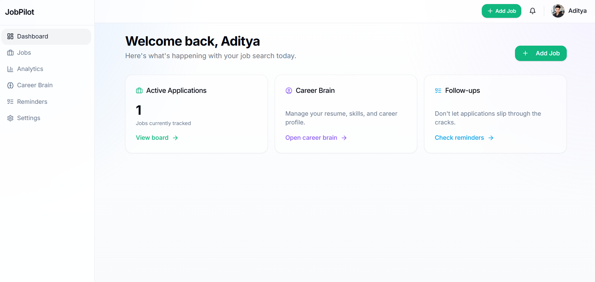
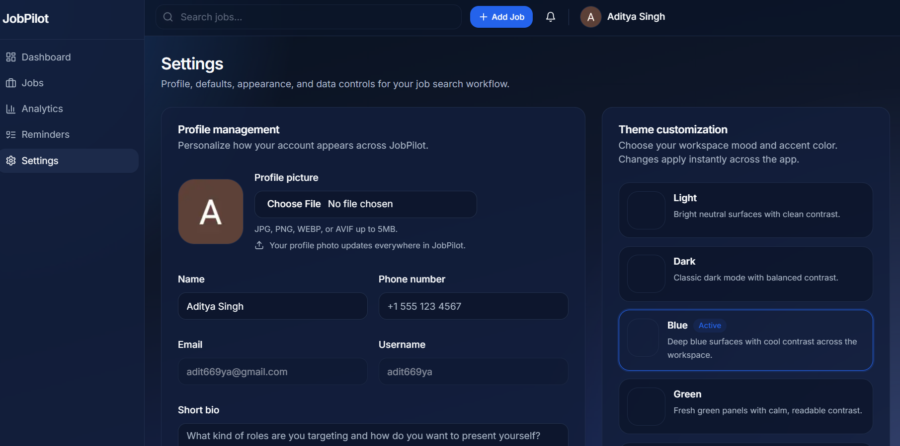

# JobPilot AI 🚀


A modern **full-stack AI-powered job application tracker** built for students, job seekers, and developers.
Track applications, organize progress with Kanban workflow, receive reminders, analytics, and manage your job hunt smarter.

---

## 🌐 Live Demo

* **Frontend:** [https://jobpilot-client-chi.vercel.app](https://jobpilot-client-chi.vercel.app/)
* **Backend API:** [https://web-dev-journey-cnee.onrender.com](https://web-dev-journey-cnee.onrender.com)

---

## 📸 Screenshots






---

## ✨ Features

### 🔐 Authentication

* Email + Password Login / Signup
* Login using Email or Username
* Google OAuth Login
* JWT Protected Routes
* Session Persistence

### 💼 Job Management

* Add / Edit / Delete Jobs
* Company, Role, Salary, Notes, Link Storage
* Track Status: Applied / Interview / Offer / Rejected

### 📋 Kanban Workflow

* Drag & Drop Job Cards
* Realtime Status Updates

### 🤖 AI Features

* AI Follow-up Message Generator
### ⏰ Reminder System

* Automated Reminder Scheduler
* Email Follow-up Alerts

### JobPilot AI - Career Operating System

JobPilot is not just a job tracker. It is a persistent **AI Career Operating System**.

It uses AI to parse your resume, build a persistent **Career Brain**, discover high-quality job matches, optimize your resume, generate personalized cover letters, prepare you for interviews, and act as your ultimate Career CRM.

## Core Features

- **Career Brain Engine:** A persistent memory of your skills, experiences, GitHub, LinkedIn, portfolio, and career goals.
- **Auto Job Hunter:** Automatically scrapes, matches, and alerts you to jobs tailored to your Career Brain.
- **AI Career Coach:**
  - Contextual Interview Preparation
  - ATS Resume Tailoring
  - Personalized Cover Letter Generation
  - Company Intelligence & Recruiter Discovery
  - Rejection Analysis
- **Daily Career Brief:** Emailed digest of your best matches and follow-ups due.
- **Skill Gap Engine:** Identifies the skills you lack across your top-matched jobs.
- **Career Strategy Dashboard:** Full metrics on your application funnel and follow-ups.

## Architecture

- **Frontend:** Next.js (App Router), TailwindCSS, shadcn/ui.
- **Backend:** Node.js, Express, MongoDB, Mongoose.
- **AI Layer:** Groq API (Llama 3 / Mixtral) for intelligent parsing, generation, and coaching.
- **Scraping Engine:** TinyFish API for raw job data extraction.
- **Scheduler:** Node-cron for background job discovery and email dispatches.

## Environment Variables

### Backend (`.env`)
**Required:**
- `MONGO_URI=`
- `JWT_SECRET=`
- `GROQ_API_KEY=` (For all AI features)
- `TINYFISH_API_KEY=` (For Auto Hunter extraction)
- `FRONTEND_URL=`

**Optional:**
- `SMTP_HOST=`, `SMTP_PORT=`, `SMTP_USER=`, `SMTP_PASS=`, `SMTP_FROM=` (For email reminders and daily briefs)
- `CLOUDINARY_CLOUD_NAME=`, `CLOUDINARY_API_KEY=`, `CLOUDINARY_API_SECRET=` (For resume uploads)
- `GOOGLE_CLIENT_ID=`, `GOOGLE_CLIENT_SECRET=` (For Google OAuth)

### Frontend (`.env.local`)
**Required:**
- `NEXT_PUBLIC_API_URL=`

## Installation

1. Clone the repo and install dependencies:
   ```bash
   cd frontend && npm install
   cd ../backend && npm install
   ```
2. Set up the Environment Variables as listed above.
3. Run the development servers:
   ```bash
   # Terminal 1
   cd backend && npm run dev
   # Terminal 2
   cd frontend && npm run dev
   ```

## Deployment

- **Frontend:** Deployable to Vercel. Ensure `NEXT_PUBLIC_API_URL` is set to your production backend URL.
- **Backend:** Deployable to Render or Heroku. Ensure MongoDB Atlas IP access allows the deployment server.

## Troubleshooting

- **AI features failing:** Ensure `GROQ_API_KEY` is valid and has sufficient quota.
- **Auto Hunter not finding jobs:** Ensure `TINYFISH_API_KEY` is configured.
- **Emails not sending:** Verify `SMTP_*` variables are correct.

## Future Roadmap (Phases 4 & 5)
- **JobPilot Companion Extension:** A Chrome/Edge extension to save jobs with 1-click.
- **Universal Job Import:** AI-driven ingestion of any job posting URL on the internet.
- **Opportunity Prioritization Engine:** Rank pipeline by Career Readiness Score.ler

---

## 📂 Folder Structure

```bash
JobPilot/
├── backend/
├── frontend/
├── docs/
├── screenshots/
└── README.md
```

---

## 🚀 Local Setup

```bash
git clone https://github.com/chauhandigvijay1/web-dev-journey.git
cd web-dev-journey/JobPilot
```

### Backend

```bash
cd backend
npm install
npm run dev
```

### Frontend

```bash
cd frontend
npm install
npm run dev
```

Open: [http://localhost:3000](http://localhost:3000)

---

## 🌍 Deployment

### Frontend (Vercel)

* Root Directory: `JobPilot/frontend`
* Add Environment Variables
* Deploy

### Backend (Render)

* Root Directory: `JobPilot/backend`
* Add Environment Variables
* Deploy

---

## 📈 Future Improvements

* AI Resume Analyzer
* Interview Questions Generator
* Cover Letter Generator
* Resume Parser AI
* Calendar Sync
* Browser Extension
* One-click Apply Tracker
* Team Collaboration Workspace
* Advanced Analytics Dashboard
* Email Follow-up Templates

---

## 👨‍💻 Author

**Digvijay Kumar Singh**

* GitHub: [chauhandigvijay1](https://github.com/chauhandigvijay1)
* LinkedIn: [digvijaykumarsingh](www.linkedin.com/in/digvijaykumarsingh)
* Portfolio: [dsc-portfolio](https://dsc-portfolio-website.netlify.app/)

---

## ⭐ Support

If you like this project, give it a **star ⭐ on GitHub**
