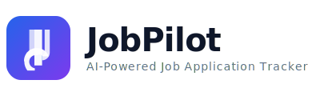
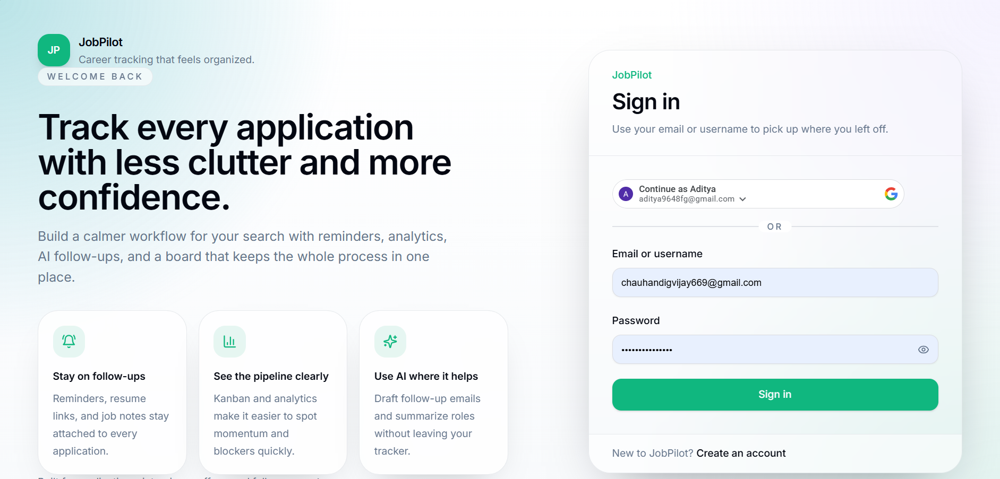
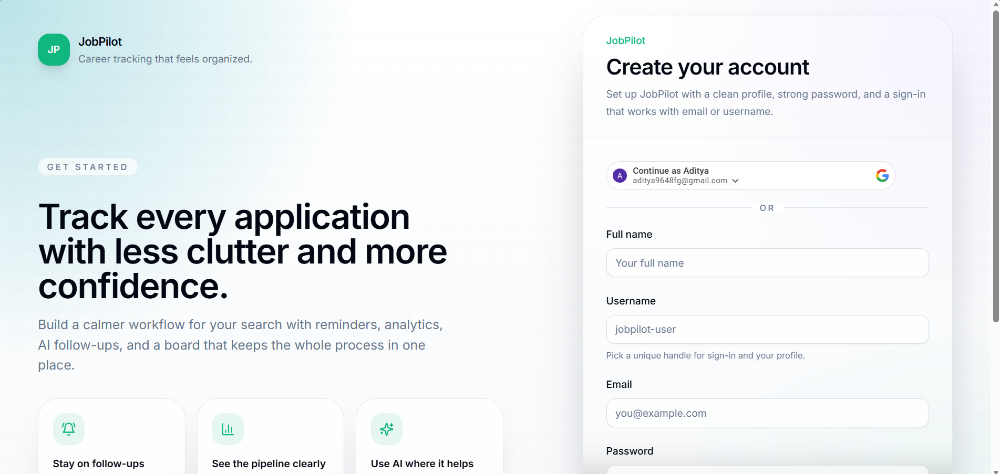
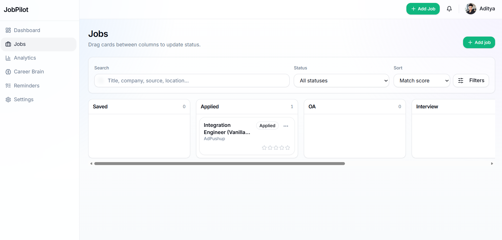
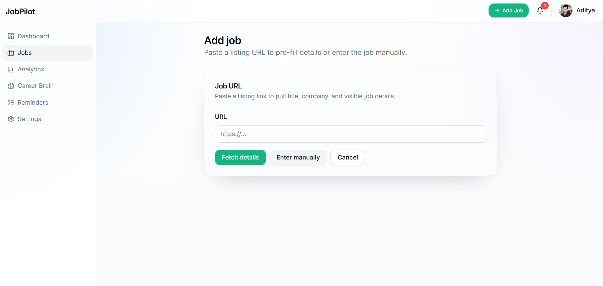
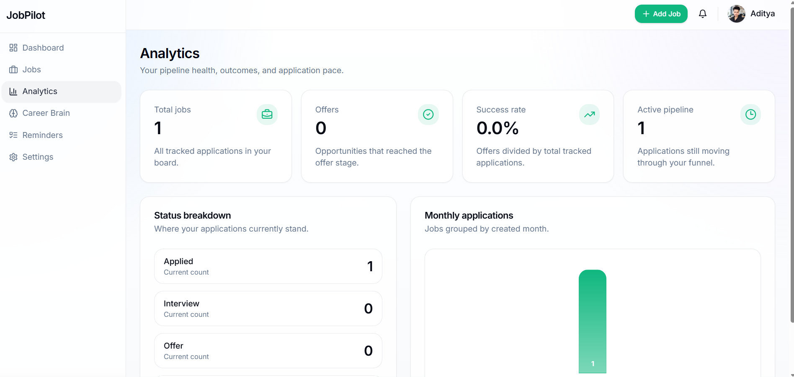
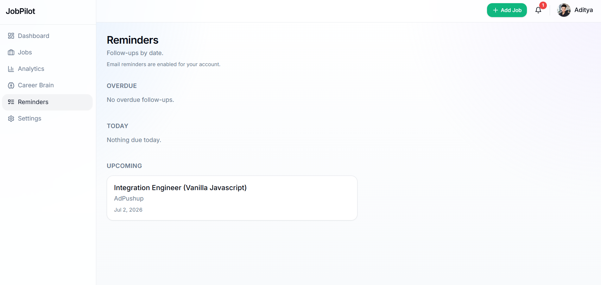
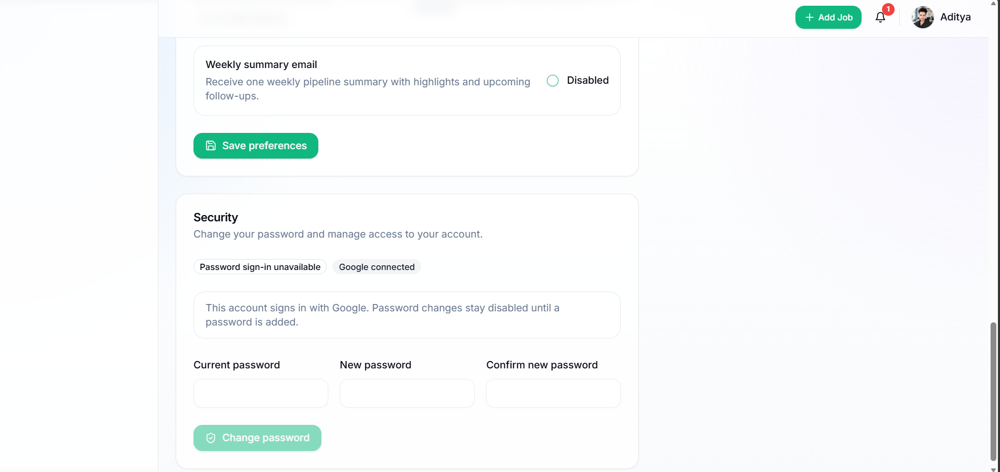

<p align="center">
  
</p>

<p align="center">
  <strong>Track every application. Land every opportunity.</strong>
</p>

<p align="center">
  <a href="#features">Features</a> •
  <a href="#screenshots">Screenshots</a> •
  <a href="#local-setup">Setup</a> •
  <a href="#architecture">Architecture</a> •
  <a href="#deployment">Deploy</a> •
  <a href="#docs">Docs</a>
</p>

<p align="center">
  
  
  
  
  
  
  
</p>

---

**JobPilot** is a full-stack, AI-powered job application management platform that replaces spreadsheets, sticky notes, and scattered browser tabs with a unified workspace. Track applications through a Kanban pipeline, generate cover letters with AI, save jobs from 50+ portals via a Chrome extension, and never miss a follow-up again.

| Layer | Stack |
|-------|-------|
| **Frontend** | Next.js 14 (App Router), TypeScript, TailwindCSS, shadcn/ui, Redux Toolkit |
| **Backend** | Node.js, Express 5, Mongoose, JWT + bcrypt, structured logging |
| **Database** | MongoDB Atlas with compound indexes and pagination |
| **AI** | Groq API (Llama 3 70B) — resume parsing, ATS scoring, cover letters, skill gaps |
| **Extension** | Chrome MV3 — 50+ job boards, LD+JSON @graph, AbortController retry |
| **Infra** | Vercel (frontend), Render (backend), Cloudinary (uploads) |

---

## Live URLs

| Service | URL |
|---------|-----|
| Web App | [https://jobpilot-client-chi.vercel.app](https://jobpilot-client-chi.vercel.app) |
| API | [https://web-dev-journey-cnee.onrender.com](https://web-dev-journey-cnee.onrender.com) |
| Extension | `cd extension && zip -r ../extension.zip .` (load unpacked in Chrome) |

---

## Features

### 📋 Kanban Pipeline
Drag jobs through **Saved → Applied → Interview → Offer → Rejected** with a visual board that keeps your entire search organized. Edit, filter, and bulk-manage applications in seconds.

### 🤖 AI-Powered Tools
- **Cover letters** — tailored to the job + your resume in one click
- **Resume parsing** — upload PDF/DOCX, AI extracts name, skills, experience, education, projects, links, and contact info with high accuracy
- **ATS scoring** — analyze how well your resume matches any specific job
- **Skill gap analysis** — paste a job description and see exactly what's missing
- **Career recommendations** — suggested roles, career paths, and skill development plans
- **Interview prep** — company-specific questions with candidate-tailored answer strategies
- **Resume tailoring** — ATS-optimized rewrite suggestions per job

### 🔌 Browser Extension
Save jobs from **LinkedIn, Indeed, Naukri, Glassdoor, Wellfound, ZipRecruiter**, and 45+ other boards with one click. Press `Alt+Shift+J` to open from any tab. Auto-detects title, company, location, salary, and description via LD+JSON and board-specific selectors.

### 🔔 Smart Reminders
Automated follow-up email reminders with configurable timing, paginated batch processing, and per-job delay settings. Never lose track of a recruiter connection.

### 📊 Analytics Dashboard
Pipeline funnel view, status distribution charts, weekly application trends, and follow-up queue to spot momentum and blockers at a glance.

### 🧠 Career Brain
Upload your resume once and unlock: parsed profile viewer, ATS match scoring against your saved jobs, job recommendations based on your skills, and skill gap analysis — all in one place.

---

## Screenshots

<details>
<summary>Click to expand — 14 screenshots</summary>

| Landing Page | Dashboard |
|--------------|-----------|
|  |  |
| **Login** | **Sign Up** |
|  |  |
| **Jobs** | **Add Job** |
|  |  |
| **Analytics** | **ATS & Skill Gap** |
|  |  |
| **Career Brain** | **Reminders** |
|  |  |
| **Profile & Theme** | **Change Password** |
|  |  |
| **Account & Job Export** | |
|  | |

</details>

---

## Local Setup

### Prerequisites
- Node.js 18+
- MongoDB (local or Atlas)
- Git
- A [Groq API key](https://console.groq.com) (free tier works)

### 1. Clone

```bash
git clone https://github.com/chauhandigvijay1/web-dev-journey.git
cd web-dev-journey/JobPilot
```

### 2. Backend

```bash
cd backend
npm install
cp .env.example .env   # edit MONGO_URI, JWT_SECRET, JWT_REFRESH_SECRET, GROQ_API_KEY
npm run dev            # → http://localhost:5051
```

### 3. Frontend

```bash
cd frontend
npm install
cp .env.local.example .env.local   # set NEXT_PUBLIC_API_URL=http://localhost:5051/api
npm run dev                        # → http://localhost:3000
```

### 4. Extension (development)

1. Open `chrome://extensions`
2. Enable **Developer mode**
3. Click **Load unpacked** → select the `extension/` folder
4. Pin the JobPilot icon to the toolbar

### 5. Verify

```bash
# Backend tests (21)
cd backend && npm test

# Frontend unit + component tests (125)
cd frontend && npm test

# E2E tests (16) — requires both servers running
cd frontend && npx playwright test

# Build
cd frontend && npm run build

# Total: 162 tests, all passing ✓
```

---

## Architecture

```
                    ┌─────────────────────────────────────┐
                    │         Chrome Extension             │
                    │  popup ↔ content ←→ background.js    │
                    │  chrome.storage + safe in-memory Map  │
                    └──────────────┬──────────────────────┘
                                   │ SYNC_AUTH_TOKEN / SAVE_JOB
                                   ▼
┌──────────────────────────────────────────────────────────────┐
│                   Next.js Frontend (Vercel)                   │
│                                                              │
│  ┌──────────┐  ┌───────────┐  ┌──────────┐  ┌───────────┐  │
│  │ App      │  │ Components│  │ Redux    │  │ Theme     │  │
│  │ Router   │  │ (shadcn)  │  │ Store    │  │ System    │  │
│  │ 13 pages │  │ + UI kit  │  │ (auth)   │  │ 7 themes  │  │
│  └──────────┘  └───────────┘  └──────────┘  │ 6 accents │  │
│                                              └───────────┘  │
│  ┌──────────┐  ┌───────────┐  ┌──────────────────────────┐  │
│  │ Services │  │ Hooks     │  │ middleware.ts             │  │
│  │ (axios,  │  │ (useJobs  │  │ (server-side auth guard)  │  │
│  │ 30s TO)  │  │ LRU cache)│  │ + security headers        │  │
│  └──────────┘  └───────────┘  └──────────────────────────┘  │
└──────────────────────────┬───────────────────────────────────┘
                           │ REST API (JWT Bearer)
                           ▼
┌──────────────────────────────────────────────────────────────┐
│                  Express Backend (Render)                     │
│                                                              │
│  ┌──────────┐  ┌───────────┐  ┌──────────┐  ┌───────────┐  │
│  │ Auth     │  │ Job CRUD  │  │ AI       │  │ Reminders │  │
│  │ bcrypt   │  │ Pagination│  │ Groq API │  │ node-cron │  │
│  │ JWT      │  │ SSRF      │  │ Rate     │  │ nodemailer│  │
│  │ OAuth    │  │ protect   │  │ limited  │  │ batch     │  │
│  └──────────┘  └───────────┘  └──────────┘  └───────────┘  │
│                                                              │
│  ┌──────────┐  ┌───────────┐  ┌──────────────────────────┐  │
│  │ Career   │  │ Uploads   │  │ Middleware                │  │
│  │ Brain    │  │ Cloudinary│  │ helmet / compression /    │  │
│  │ (resume  │  │ Multer    │  │ hpp / rate-limit /        │  │
│  │ parsing) │  │ 10 MB max│  │ sanitize / requestId      │  │
│  └──────────┘  └───────────┘  └──────────────────────────┘  │
│                                                              │
│  ┌──────────────────────────────────────────────────────┐   │
│  │  MongoDB Atlas                                        │   │
│  │  ┌──────────┐  ┌──────────────┐  ┌─────────────────┐ │   │
│  │  │ Users    │  │ Jobs         │  │ ResumeProfiles   │ │   │
│  │  │tokenVer- │  │ compound idx │  │ parsedData with  │ │   │
│  │  │sion, hash│  │ pagination   │  │ skills, projects │ │   │
│  │  └──────────┘  └──────────────┘  │ links, contact   │ │   │
│  │  ┌──────────────────────────┐    └─────────────────┘ │   │
│  │  │ ReminderQueue             │                         │   │
│  │  │ (paginated batch sweep)   │                         │   │
│  │  └──────────────────────────┘                         │   │
│  └──────────────────────────────────────────────────────┘   │
└──────────────────────────────────────────────────────────────┘
```

---

## Security

| Category | Measures |
|----------|----------|
| **Authentication** | bcrypt with salt rounds, JWT access (7d) + refresh (30d), separate secrets ≥32 chars, `tokenVersion` session invalidation on password change |
| **OWASP Top 10** | SSRF private IP blocklist, XSS via URL validation, CSP (extension), parameter pollution (hpp), input sanitization (`$`, `.`, `__proto__`) |
| **Transport** | HSTS (2 years, preload), X-Frame-Options DENY, X-Content-Type-Options nosniff, Referrer-Policy strict-origin |
| **Rate Limiting** | Auth (12/10min), API (250/15min), AI (20/15min) — all configurable via env |
| **Storage** | All `localStorage`/`chrome.storage` calls wrapped in try-catch with in-memory Map fallback (private browsing safe) |
| **API** | CORS whitelist (no null origin), compression, request IDs for audit trail, structured error logging |
| **Data Isolation** | All user-data queries scoped by `req.user._id` — no cross-tenant leakage |

---

## Environment Variables

### Backend (`backend/.env`)

| Variable | Required | Default | Description |
|----------|----------|---------|-------------|
| `MONGO_URI` | Yes | — | MongoDB connection string |
| `JWT_SECRET` | Yes | — | Access token signing secret (≥32 chars) |
| `JWT_REFRESH_SECRET` | Yes | — | Refresh token signing secret (≥32 chars) |
| `GROQ_API_KEY` | Yes | — | Groq API key for all AI features |
| `SMTP_HOST` | For reminders | — | SMTP server hostname |
| `SMTP_PORT` | For reminders | `587` | SMTP port |
| `SMTP_USER` | For reminders | — | SMTP username |
| `SMTP_PASS` | For reminders | — | SMTP password |
| `FROM_EMAIL` | For reminders | — | Sender address for reminder emails |
| `CLIENT_URL` | For CORS | `http://localhost:3000` | Allowed CORS origin |
| `NODE_ENV` | No | `development` | Environment mode |
| `AI_RATE_LIMIT_WINDOW_MINUTES` | No | `1` | AI rate limit window |
| `AI_RATE_LIMIT_MAX` | No | `10` | Max AI requests per window |

### Frontend (`frontend/.env.local`)

| Variable | Required | Description |
|----------|----------|-------------|
| `NEXT_PUBLIC_API_URL` | Yes | Backend API base URL (e.g. `http://localhost:5051/api`) |
| `NEXT_PUBLIC_GOOGLE_CLIENT_ID` | For Google auth | Google OAuth client ID |

---

## Extension Auth Flow

```
User logs in (web app)
       │
       ▼
Token stored in localStorage.jobpilot_token
       │
       ▼
Content script detects token → sends SYNC_AUTH_TOKEN to background worker
       │
       ▼
Background stores token + expiry in chrome.storage.local (with in-memory fallback)
       │
       ▼
Popup checks storage:
  ├─ Token exists + not expired → authenticated ✓
  │       │
  │       ▼
  │   Save button → SAVE_JOB → POST /api/jobs (Bearer token)
  │       │
  │       └─ 401? → remove token → request re-sync from open tab → retry
  │
  └─ No token → "Sign in to JobPilot" button → opens web app login
```

---

## Deployment

### Frontend → Vercel

| Setting | Value |
|---------|-------|
| Root directory | `JobPilot/frontend` |
| Framework | Next.js (auto-detected) |
| Environment | `NEXT_PUBLIC_API_URL` = production backend URL |

### Backend → Render

| Setting | Value |
|---------|-------|
| Root directory | `JobPilot/backend` |
| Start command | `npm start` |
| Environment | All vars from `backend/.env` |

### Extension → Chrome Web Store

```bash
cd extension
zip -r ../extension.zip .
# Upload to Chrome Developer Dashboard
```

---

## Manual Verification Checklist

<details>
<summary><strong>Web App</strong> (8 checks)</summary>

- [ ] Register a new account → redirected to dashboard
- [ ] Login with email/username → dashboard loads with 0 jobs
- [ ] Google OAuth login works
- [ ] Add a job manually (title, company, location, status) → appears in Kanban
- [ ] Drag a job card to a different status column → status updates
- [ ] Navigate to Analytics → charts show data (or empty state)
- [ ] Navigate to Settings → update preferences, save
- [ ] Visit `/login` while already logged in → redirected to dashboard
</details>

<details>
<summary><strong>Backend API</strong> (5 checks)</summary>

- [ ] `GET /api/health` → `{ success: true, data: { db: "connected" } }`
- [ ] `GET /api/jobs?page=1&limit=10` → paginated results
- [ ] `POST /api/jobs/extract` with valid URL → extracted fields
- [ ] `POST /api/jobs/extract` with `http://localhost:27017/` → SSRF warning
- [ ] AI routes return 429 after 20 requests in 15 minutes
</details>

<details>
<summary><strong>Chrome Extension</strong> (9 checks)</summary>

- [ ] Load unpacked → icon appears in toolbar
- [ ] `Alt+Shift+J` opens popup from any tab
- [ ] LinkedIn job posting → popup shows title/company + "Save"
- [ ] Click "Save" → success with "View on Dashboard"
- [ ] Click "View on Dashboard" → opens JobPilot
- [ ] Save same job again → "Already saved"
- [ ] Sign out of web app → extension shows "Sign in to JobPilot"
- [ ] Click "Sign in" → opens web app login
- [ ] Non-job page (e.g. Google) → "No job detected"
</details>

<details>
<summary><strong>Tests</strong> (6 checks)</summary>

- [ ] `cd backend && npm test` → 21 pass
- [ ] `GET /api/jobs/count` → `{ data: { count: N } }`
- [ ] `cd frontend && npm test` → 125 pass
- [ ] `cd frontend && npx playwright test` → 16 e2e pass
- [ ] `cd frontend && npm run build` → 0 errors
- [ ] **Total**: 162 passing tests ✓
</details>

---

## Tech Stack

| Category | Technologies |
|----------|-------------|
| **Frontend** | Next.js 14, TypeScript, TailwindCSS 3, shadcn/ui, Redux Toolkit, Lucide Icons |
| **Backend** | Node.js, Express 5, Mongoose, JWT, bcrypt, helmet, compression, hpp |
| **Database** | MongoDB Atlas (compound indexes, paginated queries) |
| **AI** | Groq API (Llama 3 70B), structured JSON prompts with fallback parsers |
| **Extension** | Chrome MV3, Scripting API, Storage API, AbortController + exponential backoff |
| **File Uploads** | Multer (memory storage), Cloudinary (raw + image), pdf-parse + mammoth |
| **Email** | nodemailer (cached SMTP transporter), node-cron (paginated batch reminders) |
| **Testing** | Vitest, Supertest, @testing-library/react, @testing-library/jest-dom, Playwright |
| **CI/CD** | Vercel (frontend auto-deploy), Render (backend) |

---

## Project Structure

```
JobPilot/
├── backend/                  # Express API (port 5051)
│   ├── src/
│   │   ├── config/           # env validation, database, cloudinary
│   │   ├── controllers/      # auth, jobs, AI, career-brain, upload, health
│   │   ├── middleware/        # auth guard, upload, security, rate-limits
│   │   ├── models/           # User, Job, ResumeProfile, ReminderQueue
│   │   ├── routes/           # Express routers (7 modules)
│   │   ├── services/         # auth, job, mail, reminder, job-extraction
│   │   └── utils/            # JWT, groq, cloudinary upload, async handler, logger
│   └── tests/                # 21 tests (5 files)
├── frontend/                 # Next.js 14 (13 routes)
│   ├── app/                  # App Router — landing, auth, dashboard/*
│   ├── components/           # Dashboard shell, job views, UI kit (14 primitives)
│   ├── hooks/                # useJobs (AbortController + LRU eviction)
│   ├── lib/                  # Analytics, auth, theme, reminders, filters
│   ├── store/                # Redux Toolkit (auth slice)
│   ├── services/             # Axios client (30s timeout, safe localStorage)
│   ├── public/               # favicon.svg, manifest.json, og-image.svg
│   └── tests/                # 125 unit + component + 16 e2e Playwright
├── extension/                # Chrome MV3 (50+ job boards)
│   ├── icons/                # SVG + PNG (16/48/128)
│   ├── popup.html / popup.js # Connection status, save states
│   ├── content.js            # LD+JSON @graph + 50+ board selectors
│   ├── background.js         # Auth sync, JWT enforcement, retry logic
│   └── manifest.json         # CSP, keyboard shortcut, 37 host permissions
├── docs/                     # 10 professional documentation files
│   ├── API.md                # 30+ endpoints with request/response schemas
│   ├── ARCHITECTURE.md       # Full architecture with ASCII diagram
│   ├── DATABASE.md           # Complete schema reference
│   ├── SECURITY.md           # Defense-in-depth documentation
│   ├── DEPLOYMENT.md         # Vercel + Render step-by-step
│   ├── TESTING.md            # Test strategy and coverage
│   ├── ENVIRONMENT.md        # All 40+ env vars documented
│   ├── EXTENSION.md          # 451-line extension reference
│   ├── CONTRIBUTING.md       # Contribution guidelines
│   └── CHALLENGES.md         # 350-line challenge log
├── screenshots/              # 14 PNG screenshots
├── README.md
└── LICENSE
```

---

## Documentation

The `docs/` directory contains 10 professional documentation files (2,993+ lines total):

| File | Lines | Covers |
|------|-------|--------|
| [API.md](./docs/API.md) | 810 | All 30+ endpoints, request/response examples, auth headers |
| [ARCHITECTURE.md](./docs/ARCHITECTURE.md) | 454 | ASCII architecture diagram, data flows, component interactions |
| [DATABASE.md](./docs/DATABASE.md) | 202 | Full Mongoose schema, indexes, relationships |
| [SECURITY.md](./docs/SECURITY.md) | 207 | All security measures, threat model, hardening details |
| [DEPLOYMENT.md](./docs/DEPLOYMENT.md) | 144 | Vercel + Render step-by-step guides |
| [ENVIRONMENT.md](./docs/ENVIRONMENT.md) | 129 | Every environment variable with defaults and descriptions |
| [TESTING.md](./docs/TESTING.md) | 245 | Test architecture, how to run, coverage goals |
| [EXTENSION.md](./docs/EXTENSION.md) | 451 | Full extension reference (auth flow, scraping architecture, board list) |
| [CONTRIBUTING.md](./docs/CONTRIBUTING.md) | 351 | Code style, PR workflow, development setup |
| [CHALLENGES.md](./docs/CHALLENGES.md) | 350 | All resolved challenges across 8 categories |

---

## License

MIT — built by [Digvijay Kumar Singh](https://github.com/chauhandigvijay1)
