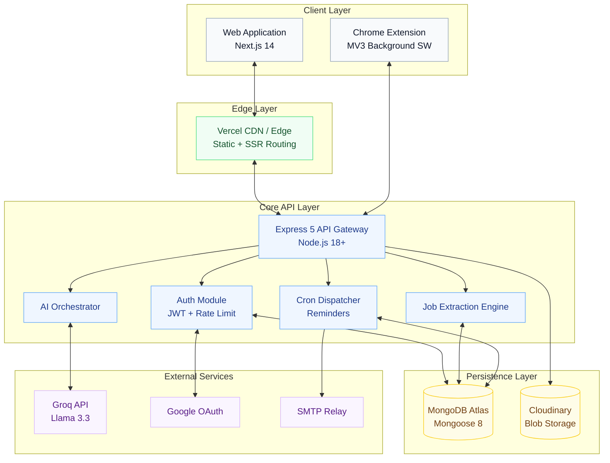
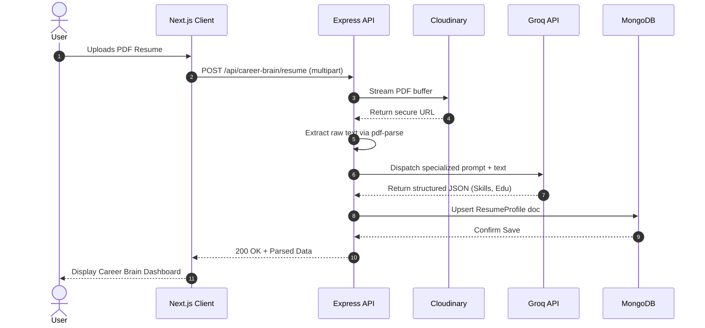

  
  <h1>JobPilot Architecture</h1>
  
<em>The blueprint of an enterprise-grade AI Career Operating System.</em>

---

## 📑 Table of Contents

1. [Executive Summary](#-executive-summary)
2. [High-Level Topology](#-high-level-topology)
3. [Component Deep Dive](#-component-deep-dive)
4. [Request Lifecycles](#-request-lifecycles)
5. [Data Architecture](#-data-architecture)
6. [Resiliency & Scalability](#-resiliency--scalability)
7. [Security Boundaries](#-security-boundaries)
8. [Related Documentation](#-related-documentation)

---

## 🎯 Executive Summary

JobPilot is engineered as a highly modular, decoupled **three-tier SaaS application** augmented by a Chrome Extension and an external LLM provider. The architecture prioritizes strict separation of concerns, ensuring that the presentation layer, business logic, and data persistence operate autonomously. This decoupling enables horizontal scaling, isolated deployments, and robust security boundaries.

> [!TIP]
> **Design Philosophy:** Everything is stateless where possible. From the Next.js edge edge-rendered frontend to the horizontally scalable Express API, state is aggressively pushed to the database and persistent caching layers.

---

## 🌐 High-Level Topology

JobPilot operates across four distinct boundaries: the **Client Layer**, the **Edge CDN**, the **API Core**, and the **Data Storage** layer.

---

## 🧩 Component Deep Dive

### 1. The Presentation Layer (Next.js 14)
Deployed natively on Vercel, the frontend leverages the **App Router** to deliver hybrid rendering. Static pages (like the landing page) are cached at the edge, while dynamic dashboards are hydrated client-side after strict Redux Toolkit authorization checks.

### 2. The Core API (Express 5)
A monolithic API structured internally as micro-services. It utilizes Express 5's native Promise handling to eliminate `try/catch` boilerplate.
- **Middleware Pipeline**: Requests pass through `helmet`, `cors`, `hpp` (parameter pollution), and a tiered rate-limiter before reaching the `auth` guard.
- **AI Orchestrator**: Wraps Groq's low-latency inference engine to generate cover letters, extract skills, and parse resumes in milliseconds.

### 3. The Extraction Engine (Chrome MV3)
A Manifest V3 extension built for extreme efficiency. It injects a localized content script into supported job boards, parses structured JSON-LD or raw DOM micro-data, sanitizes the payload, and transmits it via authenticated HTTP requests to the Core API.

---

## 🔄 Request Lifecycles

### The Resume Parsing Flow
A perfect example of cross-boundary data flow, integrating storage, AI, and business logic.

---

## 🗄️ Data Architecture

JobPilot relies on **MongoDB Atlas** as its primary system of record.

> [!IMPORTANT]
> **Compound Indexing Strategy:** To maintain sub-100ms response times on the Kanban board, the `Jobs` collection strictly enforces a compound index on `{ user: 1, status: 1, createdAt: -1 }`. Without this, dashboard hydration would require a full collection scan.

**Core Collections:**
1. `Users`: Identity, OAuth IDs, configurations, and `tokenVersion` (for session invalidation).
2. `Jobs`: The transactional hub. Contains embedded `contacts` arrays and references to the `Users` collection.
3. `ReminderQueues`: A high-throughput, volatile collection monitored by the `node-cron` dispatcher.
4. `ResumeProfiles`: A 1:1 mapping to users, storing immense JSON structures derived from AI parsing.

---

## 🛡️ Resiliency & Scalability

- **Deduplication:** The Reminder system uses a unique `dedupeKey` built from `jobId + type + scheduledDate` to ensure cron-job race conditions never result in duplicate emails.
- **Stateless Tokens:** Authentication relies on short-lived Access Tokens (15m) and long-lived Refresh Tokens (30d) rotated transparently via Axios interceptors.
- **Exponential Backoff:** The Chrome Extension utilizes the `AbortController` and `setTimeout` backoff loops if the API rate-limiter returns `429 Too Many Requests`.

---

## 🔒 Security Boundaries

Security is not an afterthought; it is woven into the architectural fabric.

| Threat Vector | Mitigation Strategy | Location |
|---------------|---------------------|----------|
| **XSS** | Strict Content-Security-Policy (CSP) headers, React DOM escaping. | Frontend / Headers |
| **SSRF** | The URL extraction endpoint blocks resolution of private/local IP ranges (`127.0.0.0/8`, `10.0.0.0/8`). | API Service Layer |
| **Session Hijacking** | Refresh tokens are strictly `httpOnly`, `Secure`, and bound to a rotatable `tokenVersion`. | Auth Controller |
| **Mass Assignment** | Strict Mongoose schemas and controller-level destructuring limits payload injection. | API Models |

---

## 📚 Related Documentation

| Area | Resource |
|------|----------|
| **Frontend Implementation** | [Frontend Documentation](./frontend.md) |
| **Database Schemas** | [Database Documentation](./database.md) |
| **API Endpoints** | [API Reference](./api.md) |
| **Infrastructure Tuning** | [Performance Guide](./performance.md) |

 

  <strong>Next Reading:</strong> <a href="./frontend.md">Frontend Architecture →</a>

