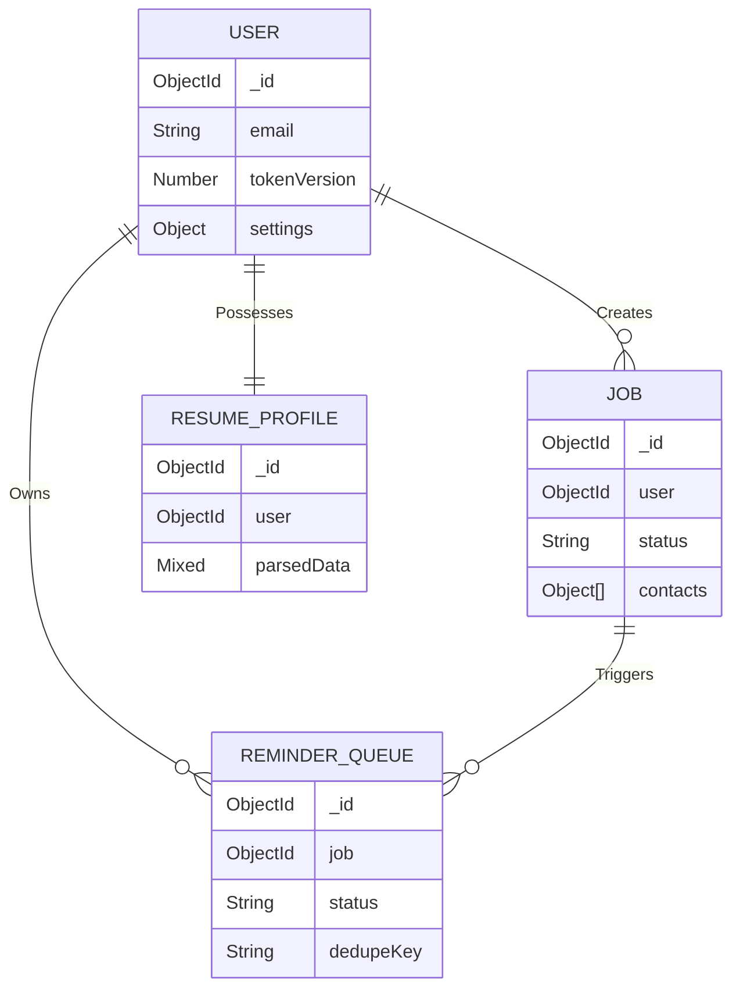

<div align="center">
  
  <h1>Database Architecture</h1>
  <p><em>MongoDB schema design, advanced indexing, and query patterns for the JobPilot ecosystem.</em></p>
</div>

---

## 📑 Table of Contents

1. [Executive Summary](#-executive-summary)
2. [Data Relationships](#-data-relationships)
3. [Schema Collections](#-schema-collections)
4. [Indexing Strategy](#-indexing-strategy)
5. [Primary Query Patterns](#-primary-query-patterns)
6. [Migration & Backup Protocol](#-migration--backup-protocol)
7. [Related Documentation](#-related-documentation)

---

## 🎯 Executive Summary

JobPilot utilizes **MongoDB Atlas** as its primary system of record, accessed securely via the **Mongoose 8** ODM. MongoDB’s flexible document model perfectly accommodates the highly polymorphic data generated across various external job boards and AI parsers. 

The architecture strictly adheres to a **denormalization philosophy** where appropriate. For example, recruiter contacts and user settings are embedded natively within their parent documents, guaranteeing atomic reads and eliminating expensive multi-collection `$lookup` joins.

---

## 🔗 Data Relationships



---

## 🗄️ Schema Collections

### 1. `users`
The global identity and configuration hub.

| Field | Type | Modifiers | Description |
|-------|------|-----------|-------------|
| `username` | String | `unique`, `sparse` | Optional handle. |
| `email` | String | `unique` | Primary login identifier. |
| `password` | String | `select: false` | Bcrypt hashed credential. |
| `tokenVersion` | Number | `default: 0` | Incremented on password change to globally invalidate sessions. |
| `refresh...` | String | `select: false` | Fields storing SHA-256 hashes of the active rotation tokens. |
| `settings` | Object | Embedded | Job preferences, productivity constraints, and notification toggles. |

### 2. `jobs`
The core transactional entity powering the Kanban pipeline.

> [!NOTE]
> The `contacts` field is an embedded sub-document array. Since jobs average only 1-5 contacts, embedding prevents unnecessary join queries.

| Field | Type | Modifiers | Description |
|-------|------|-----------|-------------|
| `user` | ObjectId | `index`, `required` | Reference to the `User`. |
| `status` | String | `enum` | Core pipeline stage (`saved`, `applied`, `interview`, `offer`, `rejected`). |
| `skills` | [String] | | Array of required competencies. |
| `contacts` | [Object] | Embedded | Recruiter details (`name`, `email`, `status`). |
| `confidenceScore`| Number | | 0-100 score utilized by the sorting algorithms. |
| `followUpDate` | Date | | Timestamp triggering the Cron Reminder Sweep. |

### 3. `reminderqueues`
An ephemeral, high-throughput collection acting as the messaging bus for the background worker.

| Field | Type | Modifiers | Description |
|-------|------|-----------|-------------|
| `type` | String | `enum` | Type of reminder (`follow_up`, `interview`, `deadline`). |
| `status` | String | `enum` | Pipeline state (`pending`, `processing`, `sent`, `failed`). |
| `scheduledFor` | Date | `required` | Threshold timestamp for Cron extraction. |
| `dedupeKey` | String | `unique` | Composite string preventing double-sending race conditions. |

### 4. `resumeprofiles`
A 1:1 mapping with the User, acting as a massive JSON storage vault for AI-parsed resume data.

| Field | Type | Modifiers | Description |
|-------|------|-----------|-------------|
| `resumeUrl` | String | | Cloudinary Blob storage reference. |
| `parsedData` | Mixed | | Flexible AI-extracted schema (summary, skills, education, projects). |
| `lastParsedAt` | Date | | Timestamp of the last successful Groq inference run. |

---

## ⚡ Indexing Strategy

To guarantee extreme performance and prevent CPU spiking under load, JobPilot enforces strict compound indexing.

| Collection | Target Fields | Direction | Purpose |
|------------|---------------|-----------|---------|
| `jobs` | `user`, `status`, `updatedAt` | `1, 1, -1` | Instant hydration of the Kanban board without in-memory sorts. |
| `jobs` | `user`, `followUpDate` | `1, 1` | Efficient querying for impending deadlines. |
| `reminderqueues` | `status`, `nextAttemptAt` | `1, 1` | O(1) latency for the `node-cron` sweep processor. |
| `reminderqueues` | `dedupeKey` | `1` | Enforcing unique constraint on insertion to prevent email spam. |

---

## 🔍 Primary Query Patterns

> [!TIP]
> **Use `.lean()`**: JobPilot explicitly chains `.lean()` onto Mongoose reads when hydrating UI components. This bypasses heavy Mongoose document hydration, significantly reducing memory bloat.

**Kanban Hydration:**
```javascript
Job.find({ user: userId }).sort({ updatedAt: -1 }).lean();
```

**Cron Processor (Atomic Lock):**
```javascript
ReminderQueue.findOneAndUpdate(
  { status: 'pending', scheduledFor: { $lte: new Date() } },
  { $set: { status: 'processing', lockedAt: new Date() } }
);
```

**Ghosting Sweep:**
```javascript
Job.updateMany(
  { user: userId, status: "saved" }, 
  { $set: { isGhosted: true } }
);
```

---

## 🛡️ Migration & Backup Protocol

JobPilot adopts an agile "no-downtime" migration philosophy. Rather than utilizing locking migration scripts, schemas are evolved gracefully directly in the code:

1. **New Fields:** Are introduced as optional with logical defaults.
2. **Deprecations:** Old schemas exist concurrently with new schemas. Mongoose getters/setters normalize data on the fly.
3. **Data Backfills:** Execute silently during server startup on lightweight worker threads when required.

### Manual Backup (Atlas)
Prior to any major release, invoke manual snapshots via `mongodump`:
```bash
mongodump --uri="<MONGO_URI>" --gzip --archive=jobpilot-$(date +%Y-%m-%d).gz
```

---

## 📚 Related Documentation

| Area | Resource |
|------|----------|
| **API Endpoints** | [API Reference](./api.md) |
| **Backend Architecture** | [Backend Engineering](./backend.md) |
| **Performance Tuning** | [Performance Insights](./performance.md) |

<br/>
<div align="center">
  <strong>Next Reading:</strong> <a href="./api.md">API Reference →</a>
</div>
