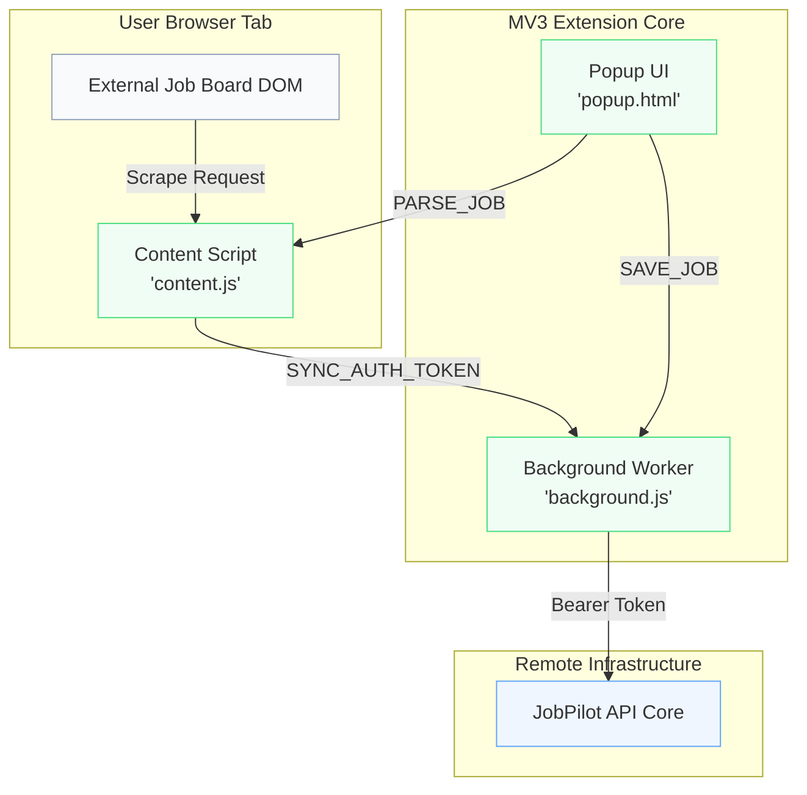

  
  <h1>Browser Extension Engineering</h1>
  
<em>The Manifest V3 (MV3) data ingestion pipeline powering one-click job scraping.</em>

---

## 📑 Table of Contents

1. [Executive Summary](#-executive-summary)
2. [Architectural Topology](#-architectural-topology)
3. [Authentication Synchronization](#-authentication-synchronization)
4. [The Content Extraction Engine](#-the-content-extraction-engine)
5. [Background Service Worker](#-background-service-worker)
6. [Security & Resiliency](#-security--resiliency)
7. [Local Development](#-local-development)
8. [Related Documentation](#-related-documentation)

---

## 🎯 Executive Summary

The **JobPilot Companion** is a highly optimized Google Chrome Extension built on the strict Manifest V3 (MV3) framework. It acts as the primary data ingestion layer, allowing users to scrape structured job data from over 50+ supported domain configurations (including LinkedIn, Indeed, and Wellfound) and seamlessly beam it to their central Kanban board.

> [!TIP]
> **Zero Configurations:** The extension operates statelessly and syncs its authentication token directly from the Next.js web application. Users never need to manually log in to the extension.

---

## 🏗️ Architectural Topology

The extension is strictly decoupled into three MV3 execution environments.

---

## 🔐 Authentication Synchronization

JobPilot utilizes a secure, passive JWT synchronization pipeline.

1. **Trigger:** User logs into the `app.jobpilot.io` web app.
2. **Detection:** The content script (`content.js`) injected on the web app detects the new `localStorage.jobpilot_token`.
3. **Transmission:** Sends a `SYNC_AUTH_TOKEN` message to the background worker.
4. **Storage:** The background worker persists the token in `chrome.storage.local` with an in-memory `Map` fallback.
5. **Validation:** The background script strictly enforces the `exp` claim and a hard 7-day TTL derived from the `iat` claim to prevent stale state.

---

## 🧠 The Content Extraction Engine

The `content.js` script employs a cascading, three-tier fallback strategy to extract job metadata without relying on brittle, site-specific CSS selectors.

| Strategy Tier | Methodology | Priority |
|---------------|-------------|----------|
| **Tier 1: Schema.org** | Scans `<script type="application/ld+json">` for `JobPosting` structures. | Highest |
| **Tier 2: Microdata** | Queries the DOM for `[itemtype*="JobPosting"]` and maps `itemprop` attributes. | High |
| **Tier 3: Generic DOM** | Iterates through prioritized selectors (e.g., `h1[class*="title"]`, `meta[property="og:title"]`). | Fallback |

### Text-Based Detection Heuristics
If structured data fails, the engine uses regex heuristics across the raw DOM text.
- **Company Detection:** Scans for patterns like `"at [Company] is hiring"`.
- **Location Detection:** Scans for `"location: [City, State]"`.
- **Description Truncation:** Grabs the main `<article>` or `[role="main"]` and safely truncates to 4000 characters to prevent API payload rejection.

---

## ⚙️ Background Service Worker

The `background.js` file handles all network transit, ensuring the API key and JWT are never exposed to the potentially hostile DOM of the job board.

> [!IMPORTANT]
> **MV3 Ephemerality:** Chrome aggressively terminates MV3 service workers to save memory. JobPilot's background worker assumes it will be killed at any moment, relying entirely on `chrome.storage.local` rather than transient global variables for state persistence.

### Network Resiliency
- **Exponential Backoff:** If the JobPilot API rate limits the extension (`429`), the worker initiates an exponential backoff sequence.
- **401 Recovery:** If the token expires mid-flight, the worker caches the `SAVE_JOB` payload, messages the content script to request a fresh token sync, and retries the save automatically.

---

## 🛡️ Security & Resiliency

Security is deeply integrated into the extension boundaries.

- **AbortControllers:** Every `fetch` request is wrapped in an `AbortController`. If a request hangs beyond 8000ms, it is cleanly severed to prevent memory leaks in the browser.
- **Content Security Policy (CSP):** Manifest defines `script-src 'self'`, preventing any remote code injection vulnerabilities.
- **Origin Validation:** The background script validates the `sender.id` of all incoming messages to prevent other extensions from spoofing JobPilot.

---

## 💻 Local Development

1. Open Chrome and navigate to `chrome://extensions`.
2. Toggle **Developer mode** in the top right.
3. Click **Load unpacked** and select the `/extension` directory.
4. Spin up the backend and frontend. The extension content script will auto-detect the `localhost:3000` development environment for token synchronization.

---

## 📚 Related Documentation

| Area | Resource |
|------|----------|
| **System Architecture** | [Architecture Details](./architecture.md) |
| **Backend Integration** | [Backend API Specs](./backend.md) |
| **E2E Testing** | [Testing Strategy](./testing.md) |

 

  <strong>Next Reading:</strong> <a href="./testing.md">Testing Infrastructure →</a>

