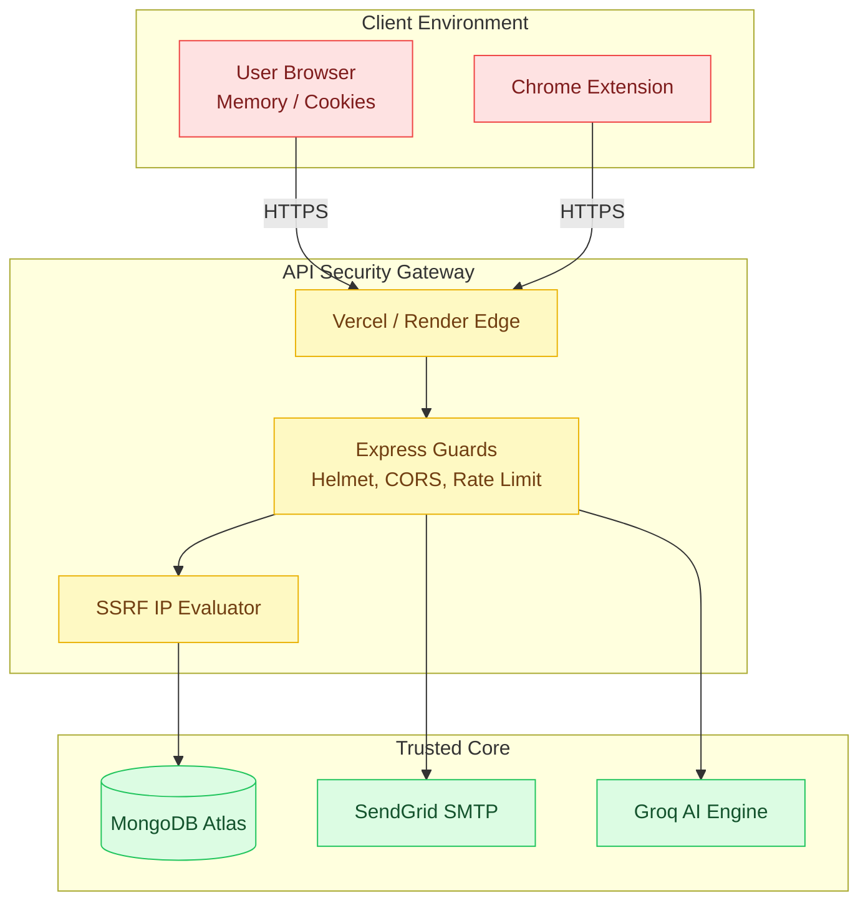

<div align="center">
  
  <h1>Security Architecture & Threat Model</h1>
  <p><em>Enterprise-grade defense-in-depth strategies protecting user data and platform integrity.</em></p>
</div>

---

## 📑 Table of Contents

1. [Executive Summary](#-executive-summary)
2. [Threat Model & Trust Boundaries](#-threat-model--trust-boundaries)
3. [Defense-in-Depth Layers](#-defense-in-depth-layers)
4. [Identity & Access Management](#-identity--access-management)
5. [Data Protection Protocol](#-data-protection-protocol)
6. [Network & Edge Security](#-network--edge-security)
7. [Security Operations Checklist](#-security-operations-checklist)
8. [Related Documentation](#-related-documentation)

---

## 🎯 Executive Summary

JobPilot operates under a strict **defense-in-depth** methodology. We assume that network perimeters will be tested, and therefore, no single configuration failure can lead to systemic compromise. Our security posture relies on zero-trust JWT orchestration, aggressive rate-limiting, and deep network boundary enforcement to protect user credentials, AI compute quotas, and MongoDB instances.

---

## 🛡️ Threat Model & Trust Boundaries

The system strictly delineates between trusted internal services and untrusted client environments.



---

## 🧱 Defense-in-Depth Layers

Every request must successfully traverse seven independent security mechanisms before business logic executes.

| Defense Layer | Implementation | Threat Mitigated |
|---------------|----------------|------------------|
| **1. Header Hardening** | `helmet` | XSS, Clickjacking, MIME/Content Sniffing |
| **2. Origin Validation**| `cors` (Strict Mode) | Cross-Origin Request Forgery |
| **3. Traffic Control** | `express-rate-limit` | Brute Force, Layer 7 DDoS, LLM Quota Exhaustion |
| **4. Payload Validation**| Mongoose + `express-validator` | NoSQL Injection, Malformed Inputs |
| **5. Identity Guard** | Cryptographic JWT Verification | Session Hijacking, Unauthorized Access |
| **6. Egress Control** | Node.js `net.isIP()` Blocklist | Server-Side Request Forgery (SSRF) |
| **7. Execution Control**| Content-Security-Policy (CSP) | Remote Code Execution in Extensions |

---

## 🔐 Identity & Access Management

### Cryptographic Hashing
- Passwords are never stored in plaintext. They are salted and hashed utilizing **Bcrypt (Cost Factor 12)**.
- Password queries explicitly define `select: false` in the Mongoose schema, guaranteeing hashes never accidentally leak into JSON payloads.

### The `tokenVersion` Revocation Strategy
To bypass the limitations of stateless JWTs, JobPilot implements instantaneous global revocation.
- **Access Tokens (15m):** Passed via `Authorization: Bearer`.
- **Refresh Tokens (30d):** Secured in an `httpOnly`, `SameSite=Lax`, `Secure` cookie.
- **The Mechanism:** Changing a password increments the user's `tokenVersion` integer in the database. Middleware checks `decoded.tokenVersion >= user.tokenVersion`. If false, the session is instantly killed.

---

## 💾 Data Protection Protocol

### Encryption In Transit
- All external traffic is forced over **TLS 1.3** via the Render and Vercel edge networks.
- Backend-to-Database communication utilizes the `mongodb+srv://` protocol, mandating TLS for all intra-cluster traffic.

### Encryption At Rest
- MongoDB Atlas inherently encrypts all physical volumes at rest utilizing AES-256.
- Sensitive refresh tokens are passed through a **SHA-256 one-way hash** before being written to the database. Even if the database is exposed, the actual cookies cannot be forged.

---

## 🌐 Network & Edge Security

> [!IMPORTANT]
> **SSRF Egress Filtering:** The JobPilot Chrome Extension requires the server to fetch external URLs to bypass CORS. To prevent attackers from passing `localhost` or internal cloud IPs (like AWS `169.254.x.x`), the URL Extraction endpoint strictly evaluates the resolved IP address against a hardcoded blocklist (`127.0.0.0/8`, `10.0.0.0/8`, etc.) before initiating the fetch.

### Dynamic CORS Configuration
The backend rejects unauthorized API consumers.
```javascript
const corsOrigins = [
  'https://jobpilot-client-chi.vercel.app',
  process.env.FRONTEND_URL,
].filter(Boolean);
// The extension uses 'chrome-extension://<id>' which is whitelisted securely.
```

---

## ✅ Security Operations Checklist

### Pre-Deployment Verification
- [ ] Ensure `.env` is explicitly declared in `.gitignore`.
- [ ] Verify `JWT_SECRET` and `JWT_REFRESH_SECRET` are distinct and ≥ 32 characters in length.
- [ ] Confirm `NODE_ENV=production` is set on Render to trigger express optimizations.
- [ ] Validate that MongoDB Atlas Network Access is restricted (remove `0.0.0.0/0`).
- [ ] Confirm SSRF blocklists cover local, loopback, and private VPC ranges.

### Incident Response Blueprint
1. **Identify:** Determine if a secret (e.g., Groq Key) or Database was compromised.
2. **Rotate:** Regenerate the exposed key via the vendor's dashboard.
3. **Revoke:** If user sessions are at risk, run a script to bump all `tokenVersion` integers by 1.
4. **Audit:** Review Vercel Edge logs and MongoDB Atlas telemetry.

---

## 📚 Related Documentation

| Area | Resource |
|------|----------|
| **Engineering Retrospective** | [Engineering Retrospective](./challenges.md) |
| **API Architecture** | [Backend API](./backend.md) |

<br/>
<div align="center">
  <strong>Next Reading:</strong> <a href="./challenges.md">Engineering Retrospective →</a>
</div>
