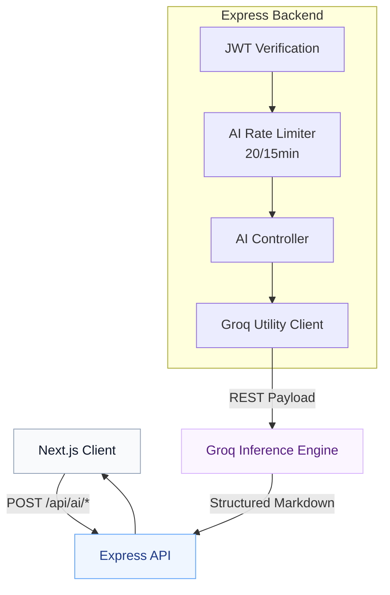

  
  <h1>AI Orchestration Engine</h1>
  
<em>The intelligence layer accelerating job searches through dynamic Groq LLM integrations.</em>

---

## 📑 Table of Contents

1. [Executive Summary](#-executive-summary)
2. [Architectural Flow](#-architectural-flow)
3. [Core Capabilities](#-core-capabilities)
4. [Prompt Engineering Protocol](#-prompt-engineering-protocol)
5. [Rate Limiting & Safeguards](#-rate-limiting--safeguards)
6. [Configuration Matrix](#-configuration-matrix)
7. [Related Documentation](#-related-documentation)

---

## 🎯 Executive Summary

JobPilot goes beyond passive data storage by integrating an active **Career Brain** powered by Groq's high-speed inference engine (`llama-3.3-70b-versatile`). The AI layer handles 8 distinct, context-aware operations—from generating tailored cover letters to performing ATS compatibility scoring against live job descriptions.

> [!NOTE]
> **Stateless Inference:** To ensure absolute privacy and security, the AI service operates statelessly. No chat history is preserved. Every API request injects the entire necessary context (Resume JSON + Job Description) into the payload for a single-shot generation.

---

## 🔄 Architectural Flow

Security and API key protection dictate that the frontend **never** interacts with Groq directly. All inference requests are strictly proxied through the authenticated backend pipeline.

---

## 🤖 Core Capabilities

| Capability | Input Context | Output Format | Description |
|------------|---------------|---------------|-------------|
| **Follow-Up Emails** | Title, Company, Notes | Plain Text | Drafts warm, highly contextual nudges for recruiters. |
| **Interview Prep** | Job Description | Markdown | Anticipates behavioral and technical questions based on required skills. |
| **Job Summarization**| Full Job Payload | Markdown | Condenses dense JDs into a scannable 3-bullet overview. |
| **Cover Letter** | JD + Resume Profile | Markdown | Generates a ready-to-edit, deeply personalized narrative. |
| **Resume Tailoring** | JD + Resume Profile | Markdown | Suggests precise layout adjustments to bypass ATS filters. |
| **ATS Score** | JD + Resume Profile | Numeric/JSON | Outputs a deterministic compatibility percentage. |
| **Recommendations** | Resume Profile | JSON | Identifies logical lateral or upward career pivots. |
| **Skill Gap Analysis**| JD + Resume Profile | Markdown | Highlights the exact tools and languages missing from the candidate's profile. |

---

## 🧠 Prompt Engineering Protocol

All prompts reside in `backend/src/controllers/ai.controller.js` and follow a rigid, deterministic template structure executed via the `groqChat` utility.

### The Anatomy of a JobPilot Prompt
1. **System Persona:** Forces the model into a hyper-specific role (e.g., *“You are an elite Silicon Valley technical recruiter.”*).
2. **Context Injection:** Injects heavily sanitized data from the database (preventing prompt injection attacks).
3. **Format Enforcement:** Explicitly dictates the output shape (e.g., *“Return ONLY valid markdown with `##` headers. Do not include introductory pleasantries.”*).
4. **Temperature Control:** Strictly clamped at `0.35` for analytical tasks (ATS scoring) and `0.7` for creative tasks (Cover Letters).

---

## 🛡️ Rate Limiting & Safeguards

LLM integrations are frequent targets for abuse. JobPilot enforces strict telemetry and bounding.

### Rate Limiting Policy
All 8 AI features share a dedicated bucket, independent of the general API limiter.

- **Window:** 15 Minutes
- **Max Requests:** 20 per User
- **Violation:** Returns `429 Too Many Requests` with a deterministic `Retry-After` header.

### Graceful Degradation
| Scenario | Handling Strategy | Status Code |
|----------|-------------------|-------------|
| **Missing API Key** | Fails fast at the middleware layer. | `503 Service Unavailable` |
| **Groq API Timeout** | Caught via `AbortController` in Axios. | `504 Gateway Timeout` |
| **Malformed Output** | Caught by JSON parsing wrappers. | `502 Bad Gateway` |
| **Missing Job Context** | Controller intercepts prior to inference. | `404 Not Found` |

---

## ⚙️ Configuration Matrix

The AI engine is controlled via the core environment variables.

| Variable | Requirement | Default Fallback | Purpose |
|----------|-------------|------------------|---------|
| `GROQ_API_KEY` | **Required** | — | Master authentication token for Groq. |
| `GROQ_MODEL` | Optional | `llama-3.3-70b-versatile` | Swappable engine for specific inference needs. |
| `AI_RATE_LIMIT_MAX` | Optional | `20` | Adjusts capacity per 15-minute sliding window. |

---

## 📚 Related Documentation

| Area | Resource |
|------|----------|
| **Backend Integration** | [Backend Architecture](./backend.md) |
| **API Endpoints** | [API Reference](./api.md) |
| **Workflow Automation**| [Core Workflows](./workflow.md) |

 

  <strong>Next Reading:</strong> <a href="./extension.md">Chrome Extension Guide →</a>

