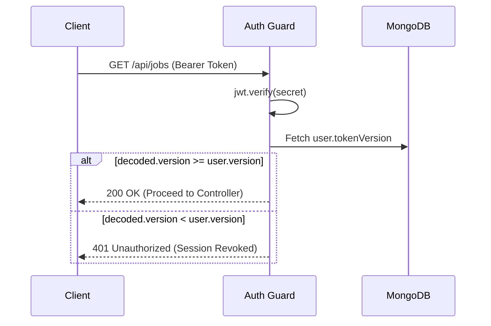

<div align="center">
  
  <h1>Backend Engineering</h1>
  <p><em>The core Express monolith driving the AI engine, background workers, and core logic.</em></p>
</div>

---

## 📑 Table of Contents

1. [Executive Summary](#-executive-summary)
2. [Project Architecture](#-project-architecture)
3. [The Authentication Engine](#-the-authentication-engine)
4. [Middleware & Security Pipeline](#-middleware--security-pipeline)
5. [Core Services](#-core-services)
6. [Background Workers](#-background-workers)
7. [Database Models](#-database-models)
8. [Running Locally](#-running-locally)
9. [Related Documentation](#-related-documentation)

---

## 🎯 Executive Summary

The JobPilot backend is an **Express 5 REST API** designed to operate as a high-performance monolith with microservice-like internal boundaries. Deployed on Render, it manages over 35 distinct endpoints, orchestrates complex AI inference pipelines via Groq, strictly typed MongoDB operations via Mongoose 8, and hosts an autonomous background worker for the reminder system.

> [!TIP]
> **Express 5 Advantage:** Upgrading to Express 5 allows native Promise handling. The codebase eliminates verbose `try/catch` wrappers, relying entirely on the native async routing capabilities and a centralized JSON error handler.

---

## 📂 Project Architecture

The `backend` adheres strictly to the Controller-Service-Model paradigm, ensuring business logic never bleeds into HTTP routing.

```text
backend/
├── src/
│   ├── app.js                    # 🛡️ Global middleware & security pipeline
│   ├── server.js                 # 🚀 Entry point, Mongo init, Cron bootstrap
│   ├── config/                   # ⚙️ Env validations, Cloudinary SDK setup
│   ├── controllers/              # 🚦 HTTP handlers (Auth, Jobs, AI)
│   ├── middleware/               # 🛑 Auth guards, Rate limiters, Multer
│   ├── models/                   # 🗄️ Mongoose Schemas (User, Job, Queue)
│   ├── routes/                   # 🛣️ Express Router definitions
│   ├── services/                 # 🧠 Core Business Logic (Mail, Reminders, AI)
│   └── utils/                    # 🛠️ Helpers (JWT signing, Logger, Groq client)
└── tests/                        # 🧪 Integration & Unit testing suites
```

---

## 🔐 The Authentication Engine

JobPilot implements an enterprise-grade **Dual JWT Strategy** to balance strict security with seamless user experience.

### Architecture

| Token Type | Storage | TTL | Responsibility |
|------------|---------|-----|----------------|
| **Access Token** | Memory / LocalStorage | 15 minutes | Sent via `Authorization: Bearer` to authenticate API hits. |
| **Refresh Token** | `httpOnly`, `Secure` Cookie | 30 days | Exchanged via `/api/auth/refresh` when the Access Token expires. |

### Session Invalidation (`tokenVersion`)
Traditional JWTs cannot be revoked without a centralized Redis blacklist. JobPilot solves this elegantly using a `tokenVersion` integer embedded in the user's database document.
- **The Mechanism:** Every minted JWT contains the user's current `tokenVersion`. 
- **The Guard:** The Auth Middleware checks `if (decoded.tokenVersion < user.tokenVersion) throw Error`.
- **The Execution:** When a user changes their password, `user.tokenVersion++` is executed, instantly invalidating every active session globally without centralized caching.



---

## 🛡️ Middleware & Security Pipeline

Every incoming request traverses a fortified pipeline before touching business logic.


> [!IMPORTANT]
> **SSRF Hardening:** The Job Extraction service actively blocks URL requests routing to loopback addresses (`127.0.0.1`), mitigating Server-Side Request Forgery attacks when fetching job metadata from external sites.

---

## 🧠 Core Services

The business logic resides in isolated service files, allowing the Express controllers to remain lightweight.

### 1. Job Service (`job.service.js`)
Manages the Kanban state. Enforces a 32-field normalization matrix, capping string lengths, validating enums (`saved`, `applied`, `interview`), and embedding sub-documents for recruiter contacts.

### 2. AI Orchestrator (`ai.controller.js` -> `groq.js`)
Serves as the gateway to the Groq Llama 3 API. Orchestrates specialized system prompts for distinct features (Cover Letters, Skill Gaps, ATS Scoring) while respecting a dedicated `aiRateLimiter` of 20 requests per 15 minutes to prevent LLM abuse.

### 3. Mail Service (`mail.service.js`)
Maintains a globally cached Nodemailer transport. Compiles raw data into branded HTML templates, preventing SMTP TLS-handshake overhead on every dispatch.

---

## ⏳ Background Workers

JobPilot runs a concurrent background worker inside the Node process to handle the Smart Reminder System.

### The Cron Sweep
Powered by `node-cron`, the sweep executes every 10 minutes:
1. **Query:** Scans the `ReminderQueue` for `{ status: "pending", scheduledFor: { $lte: now } }`.
2. **Atomic Lock:** Executes a `findOneAndUpdate` to shift the status to `processing`, preventing race conditions.
3. **Dispatch:** Transmits the email via the Mail Service.
4. **Resolution:** Marks as `sent` or schedules an exponential backoff retry.

---

## 🗄️ Database Models

Data is structured across four primary MongoDB collections.

| Collection | Role | Key Indexes |
|------------|------|-------------|
| `Users` | Identity and settings. | `email` (Unique), `username` (Unique, Sparse) |
| `Jobs` | Transactional application data. | `{ user: 1, status: 1, createdAt: -1 }` (Compound) |
| `ReminderQueues` | High-throughput worker queues. | `{ status: 1, scheduledFor: 1 }`, `dedupeKey` (Unique) |
| `ResumeProfiles` | Mass-storage of AI-parsed JSON structures. | `user` (Unique 1:1 map) |

---

## 🚀 Running Locally

```bash
cd backend

# 1. Install dependencies
npm install

# 2. Configure environment
cp .env.example .env
# Required: MONGO_URI, JWT_SECRET, JWT_REFRESH_SECRET, GROQ_API_KEY

# 3. Spin up the development server
npm run dev
# → API live at http://localhost:5051

# 4. Verify System Health
npm test
```

---

## 📚 Related Documentation

| Area | Resource |
|------|----------|
| **Database Deep Dive** | [Database Documentation](./database.md) |
| **API Endpoints** | [API Reference](./api.md) |
| **Testing Strategy** | [Testing Pipeline](./testing.md) |

<br/>
<div align="center">
  <strong>Next Reading:</strong> <a href="./database.md">Database Architecture →</a>
</div>
