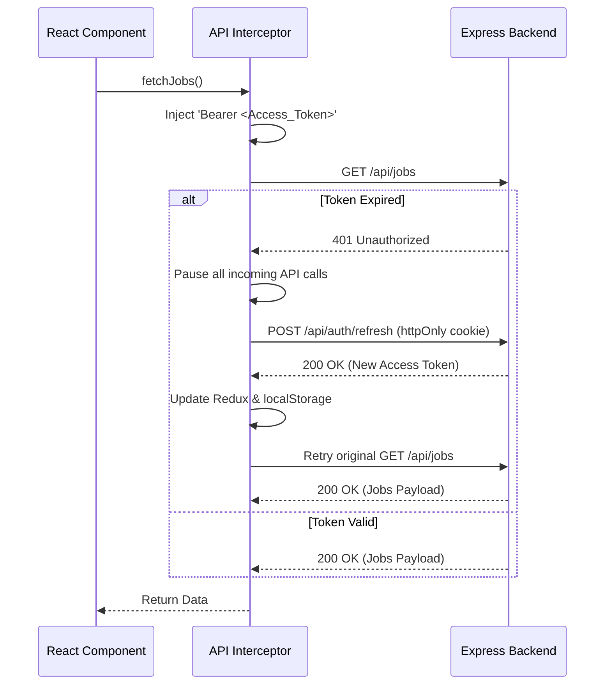

<div align="center">
  
  <h1>Frontend Engineering</h1>
  <p><em>The Next.js presentation layer driving a zero-latency, AI-first user experience.</em></p>
</div>

---

## 📑 Table of Contents

1. [Executive Summary](#-executive-summary)
2. [Technology Stack](#-technology-stack)
3. [Directory Architecture](#-directory-architecture)
4. [Component Design System](#-component-design-system)
5. [State & Data Fetching](#-state--data-fetching)
6. [Authentication Flow](#-authentication-flow)
7. [Theming Engine](#-theming-engine)
8. [Performance & Tooling](#-performance--tooling)
9. [Related Documentation](#-related-documentation)

---

## 🎯 Executive Summary

The JobPilot frontend is engineered to be as intelligent and responsive as the AI driving it. Built on the **Next.js 14 App Router**, the interface relies heavily on aggressive caching, optimistic UI updates, and an elegant component design system. By decoupling global state management (Redux) from server-state fetching (Axios hooks), the application achieves a highly scalable, maintainable, and snappy user experience.

> [!NOTE]
> The entire frontend is written in strict **TypeScript (v5)**. Any new components, hooks, or API payloads must define precise interfaces to maintain type-safety across the monorepo boundary.

---

## ⚡ Technology Stack

| Domain | Technology | Implementation Detail |
|--------|------------|-----------------------|
| **Core Framework** | Next.js 14 | App Router for layout preservation and nested routing. |
| **Styling** | TailwindCSS 3 | Utility-first CSS with dynamic variable injection for themes. |
| **Component Library** | shadcn/ui | 14 primitive components managed via Radix UI for accessibility. |
| **State Management** | Redux Toolkit 2 | Managing authentication sessions and global user preferences. |
| **Data Fetching** | Axios 1.7+ | Centralized interceptors with transparent token rotation. |
| **Drag & Drop** | `@dnd-kit/core` | High-performance physics engine for the Kanban board. |
| **Testing** | Vitest + Playwright | 140+ unit/component tests, and E2E visual verification. |

---

## 📂 Directory Architecture

The `frontend` strictly follows domain-driven structuring.

```text
frontend/
├── app/                      # 📍 Next.js App Router
│   ├── (auth)/               # Route groups for login/signup
│   ├── dashboard/            # Core application layout
│   │   ├── analytics/        # Charting and data viz
│   │   ├── jobs/             # Kanban board and detail view
│   │   └── career-brain/     # AI resume parsing interface
│   ├── layout.tsx            # Global layout (ThemeProvider)
│   └── globals.css           # Tailwind directives & CSS variables
├── components/               # 🧩 Reusable UI
│   ├── ui/                   # shadcn/ui primitives (Button, Dialog, Input)
│   ├── job/                  # Complex domain components (Kanban columns)
│   └── analytics/            # Recharts integration wrappers
├── hooks/                    # 🎣 Custom React Hooks (useJobs, useTheme)
├── lib/                      # 🛠️ Utility Functions
│   ├── authStorage.ts        # Fallback-safe localStorage wrappers
│   └── theme.ts              # Theme configuration matrices
├── services/                 # 🌐 API Client layer
│   └── api.ts                # Axios instance & interceptors
└── store/                    # 📦 Redux configuration
    └── authSlice.ts          # Session hydration and management
```

---

## 🎨 Component Design System

JobPilot leverages **shadcn/ui** to build a bespoke design system rather than relying on heavy, monolithic component libraries. 

### Principles
1. **Composition over Configuration:** Complex interfaces (like the `JobDetailView`) are constructed from dozens of highly specialized micro-components (`Badge`, `Separator`, `Card`).
2. **Accessibility First:** All interactive elements utilize Radix UI primitives underneath, ensuring seamless screen-reader support and keyboard navigation.
3. **Tailwind Variables:** We never hardcode colors (e.g., `text-blue-500`). We map everything to semantic variables (`text-primary`, `bg-muted`) to ensure the theming engine works flawlessly.

---

## 🔄 State & Data Fetching

JobPilot establishes a strict boundary between **Global Client State** and **Server State**.

### Global State (Redux Toolkit)
The Redux store exclusively manages the authentication session (`user`, `token`, `isAuthenticated`). 
- **Hydration:** The store automatically rehydrates from `localStorage` on initial mount to prevent layout shifts.

### Server State (Custom Hooks + Axios)
Data fetching avoids Redux entirely to prevent boilerplate bloat.
- The `useJobs.ts` hook acts as a mini-cache. It maintains an LRU map of fetched jobs, drastically reducing TTFB (Time to First Byte) when users rapidly navigate between the Dashboard and Kanban views.
- **Optimistic Updates:** When a user drags a card on the Kanban board, the React state mutates *immediately*, bypassing network latency. If the backend API throws an error, the state rolls back to the previous snapshot gracefully.

---

## 🔐 Authentication Flow

The Axios client acts as the central security checkpoint for the frontend.



---

## 🎭 Theming Engine

JobPilot ships with a deeply integrated theme matrix, supporting **7 Base Themes** and **6 Accent Colors**.

> [!TIP]
> **FOUC Prevention:** Flash of Unstyled Content (FOUC) is mitigated by injecting a blocking, inline `<script>` at the very top of `app/layout.tsx`. This script evaluates `localStorage` and applies the correct `data-theme` and `.dark` classes to the `<html>` root before the DOM begins parsing.

---

## 🚀 Performance & Tooling

- **next/image:** All external media (Cloudinary profile pictures, company logos) are routed through Next.js image optimization, automatically converted to WebP, and lazy-loaded.
- **Strict Linting:** The CI pipeline enforces rigorous ESLint rules. 
- **Testing Matrix:**
  - 107 Pure Function Tests (Vitest)
  - 18 Component Tests (React Testing Library)
  - 16 End-to-End browser tests (Playwright)

---

## 📚 Related Documentation

| Area | Resource |
|------|----------|
| **System Architecture** | [Architecture Overview](./architecture.md) |
| **API Integration** | [API Reference](./api.md) |
| **Deployment Setup** | [Deployment Guide](./deployment.md) |
| **Testing Strategy** | [Testing Documentation](./testing.md) |

<br/>
<div align="center">
  <strong>Next Reading:</strong> <a href="./api.md">API Reference →</a>
</div>
