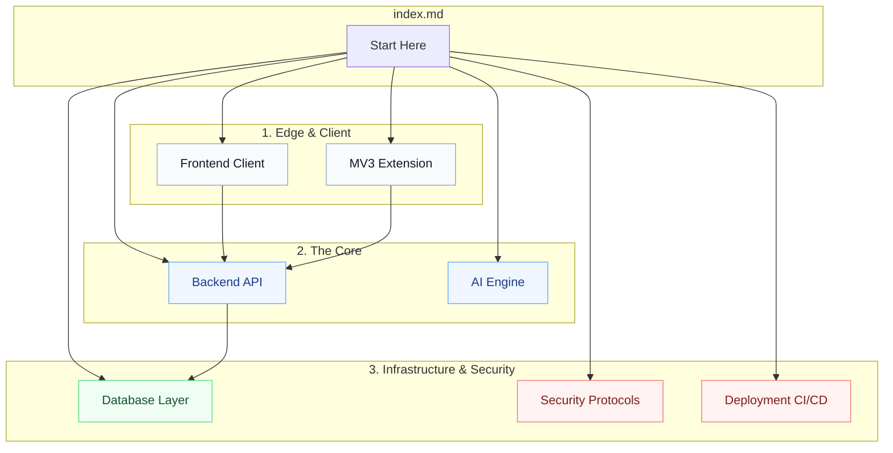

  
  <h1>JobPilot Documentation Hub</h1>
  
<em>The ultimate engineering reference for the JobPilot Career Operating System.</em>

---

## 🚀 Welcome to the Knowledge Base

JobPilot is a full-stack, AI-powered career tracking ecosystem engineered for scale, security, and speed. Whether you are deploying the platform to your own enterprise cluster or contributing to the core open-source repository, this hub provides the definitive architectural blueprints.

### Quick Start Sequences

| Objective | Action | Target Reference |
|-----------|--------|------------------|
| **1. Configuration** | Set up mandatory `.env` secrets | [Environment Setup](./environment.md) |
| **2. API Initialization** | Start the Express backend | [Backend Architecture](./backend.md) |
| **3. Client Hydration** | Spin up the Next.js presentation layer | [Frontend Architecture](./frontend.md) |
| **4. Ingestion Engine** | Load the MV3 Web Scraper into Chrome | [Extension Workflows](./extension.md) |
| **5. Quality Assurance** | Execute the Vitest & Playwright matrices | [Testing Infrastructure](./testing.md) |

---

## 🗺️ Ecosystem Topology

Understand how the documentation maps to the physical architecture.

---

## 📚 Core Technical Blueprints

Dive deep into the specific subsystems powering JobPilot.

> **[Architecture Overview](./architecture.md)**  
> The foundational masterclass on JobPilot's monorepo structure, decoupled data flows, and the rationale behind choosing Next.js, Express, and MongoDB.

> **[Frontend Infrastructure](./frontend.md)**  
> Next.js App Router mechanics, Redux state management, custom LRU hooks, and our Tailwind utility-first design system.

> **[Backend Architecture](./backend.md)**  
> Express 5 asynchronous logic, JWT middleware pipelines, rate-limiting algorithms, and autonomous cron daemons for email dispatch.

> **[Database Design](./database.md)**  
> Mongoose schema designs, polymorphic setups for scraping, and compound indexing strategies for O(1) retrieval.

> **[API Reference](./api.md)**  
> Comprehensive endpoint definitions, parameter constraints, and structured JSON response examples for external integration.

> **[AI Orchestration Engine](./ai.md)**  
> Groq LPU integration, advanced prompt engineering, and stateless context passing for instant Cover Letter and ATS generation.

> **[Browser Extension Engineering](./extension.md)**  
> Manifest V3 constraints, cascading DOM extraction algorithms (`LD+JSON` to raw text), and cross-context auth syncing.

---

## 🛡️ DevOps, QA & Security

> **[Security Posture](./security.md)**  
> Threat modeling, zero-trust cryptographic architectures, SSRF IP blocklists, and OWASP boundary protections.

> **[Environment Configuration](./environment.md)**  
> Strict definitions and validation logic for all mandatory and optional `.env` configurations.

> **[Deployment Pipelines](./deployment.md)**  
> CI/CD deployment strategies across Vercel (Client Edge), Render (API), and the Chrome Web Store.

> **[Testing Matrix](./testing.md)**  
> Methodologies for our 160+ test suite spanning Unit (Vitest), Integration (Supertest), and End-to-End (Playwright) boundaries.

> **[Performance Tuning](./performance.md)**  
> Memory-bound LRU caching, algorithmic database query reductions, and high-frequency UI hydration optimizations.

---

## 🌍 Product Vision & Collaboration

> **[Engineering Case Study](./case-study.md)**  
> A premium, deep-dive whitepaper into the specific engineering hurdles (like O(N) database latency) and how they were solved.

> **[Strategic Roadmap](./roadmap.md)**  
> Phased, quarterly milestones for enterprise hardening, PDF parsing, and React Native mobile app development.

> **[Contributing Guide](./contributing-guide.md)**  
> Strict Pull Request workflows, Semantic Versioning commit standards, and community engagement protocols.

> **[Troubleshooting Runbook](./troubleshooting.md)**  
> Standard Operating Procedures (SOPs) for resolving complex runtime, Docker, or configuration errors.

> **[Frequently Asked Questions](./faq.md)**  
> Quick answers to setup bottlenecks, AI usage quotas, and architectural rationale.

---

## 🔗 Global Quick Links

- **Live Application:** [jobpilot-client-chi.vercel.app](https://jobpilot-client-chi.vercel.app)
- **API Edge Engine:** [web-dev-journey-cnee.onrender.com](https://web-dev-journey-cnee.onrender.com)
- **GitHub Repository:** [chauhandigvijay1/web-dev-journey](https://github.com/chauhandigvijay1/web-dev-journey)
- **Return to Root README:** [View Master File](../README.md)

 

  <strong>Begin Your Journey:</strong> <a href="./architecture.md">Explore the System Architecture →</a>

