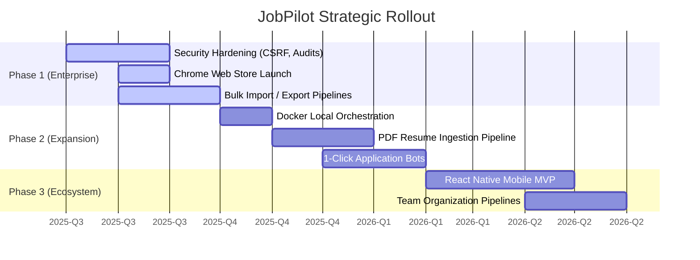

  
  <h1>Strategic Roadmap</h1>
  
<em>The engineering trajectory toward a collaborative, enterprise-grade Career OS.</em>

---

## 📑 Table of Contents

1. [Executive Summary](#-executive-summary)
2. [Current Architecture Baseline](#-current-architecture-baseline)
3. [Phase 1: Enterprise Hardening (Next 3 Months)](#-phase-1-enterprise-hardening)
4. [Phase 2: Platform Expansion (3–6 Months)](#-phase-2-platform-expansion)
5. [Phase 3: Scale & Ecosystem (6–12 Months)](#-phase-3-scale--ecosystem)
6. [Milestone Timeline](#-milestone-timeline)
7. [Contributing & Feature Requests](#-contributing--feature-requests)

---

## 🎯 Executive Summary

JobPilot is rapidly evolving. Having successfully established a secure, high-performance baseline with an **8.2/10** internal architectural rating (v1.0.2), our immediate trajectory focuses on robust security hardening, multi-tenant collaboration, and deploying native mobile applications.

> [!TIP]
> **Community Driven:** This roadmap is dynamic. If your organization requires a specific feature (like custom Single Sign-On or ATS integrations), open a GitHub Issue and tag it with `enterprise-request`.

---

## 🏗️ Current Architecture Baseline

Our foundational platform is fully operational and battle-tested.

### Core Capabilities Deployed
- ✅ **Full CRUD Job Tracking:** Fluid drag-and-drop Kanban dashboard.
- ✅ **Advanced Identity:** Dual JWT stateless authentication + Google OAuth.
- ✅ **Data Ingestion:** Chrome MV3 Extension targeting 50+ job boards.
- ✅ **AI Orchestration:** 8 specialized Llama-3 endpoints (ATS Scoring, Cover Letters, Skill Gaps).
- ✅ **Automated Workflows:** Cron-based email dispatch for interview reminders.
- ✅ **Infrastructure:** 162+ comprehensive CI/CD tests maintaining system integrity.

---

## 🔒 Phase 1: Enterprise Hardening
*Target: Next 3 Months*

The immediate priority is preparing the platform for multi-user organizational deployment.

### Security & Compliance
| Initiative | Impact | Complexity | Status |
|------------|--------|------------|--------|
| **Synchronizer Tokens (CSRF)** | Mitigates cross-site state mutation risks. | Low | Scheduled |
| **Intelligent Rate Limiting** | Implements account lockout logic on sequential failed authentications. | Low | Scheduled |
| **Audit Logging** | Granular MongoDB tracking for sensitive authentication operations. | Medium | Scheduled |

### Quality of Life & Extraction
| Initiative | Impact | Complexity | Status |
|------------|--------|------------|--------|
| **Bulk Portability** | Bi-directional CSV/JSON import/export for data sovereignty. | Medium | Scheduled |
| **Advanced Querying** | Filter and sort via AI Priority Score and specific sub-locations. | Medium | Scheduled |
| **Web Store Deployment**| Finalizing the Chrome Web Store submission for 1-click extension installs. | Medium | Scheduled |

---

## 🚀 Phase 2: Platform Expansion
*Target: 3–6 Months*

Expanding the scope of JobPilot from a tracking tool to an active application engine.

### AI & Automation Enhancements
| Feature | Description | Priority |
|---------|-------------|----------|
| **PDF Resume Ingestion** | Utilize AI to map unstructured PDF data directly into the JobPilot JSON schema. | High |
| **1-Click Apply Bridge** | Chrome extension actively filling out Workday/Greenhouse forms using the User Profile. | High |
| **Mock Interview Bot** | Real-time, voice-to-text behavioral interview simulations powered by Groq. | High |
| **Salary Analytics** | Market comparison mapping against expected vs. offered metrics. | Medium |

### Developer Experience (DX)
| Initiative | Description | Priority |
|------------|-------------|----------|
| **OpenAPI/Swagger Spec** | Auto-generating API schemas for external developer consumption. | Medium |
| **Docker Composition** | 1-click local setup utilizing `docker-compose up` for the DB, API, and Frontend. | High |

---

## 🌍 Phase 3: Scale & Ecosystem
*Target: 6–12 Months*

The final phase shifts JobPilot toward global accessibility and collaborative organization management.

### Ecosystem Milestones
| Milestone | Description | Complexity |
|-----------|-------------|------------|
| **Native Mobile App** | A dedicated React Native application mirroring core tracking and push notifications. | Very High |
| **Team Organizations** | Shared Kanban pipelines for university placement cells and career coaches. | High |
| **Network Graph** | Visualizing relational data between Companies, Recruiters, and Offers. | Medium |
| **Kubernetes Helm Charts**| Enterprise-grade clustering deployments for self-hosted SaaS environments. | Medium |
| **Global Localization** | i18n support across the frontend UI. | Medium |

---

## 📅 Milestone Timeline

---

## 🤝 Contributing & Feature Requests

Have a feature idea that accelerates career mobility? 
1. Open a [GitHub issue](https://github.com/chauhandigvijay1/JobPilot/issues) applying the `feature-request` label.
2. We review and prioritize requests monthly based on **Impact**, **Implementation Complexity**, and **Vision Alignment**.
3. Ready to code? Check the [Contributing Guide](./contributing-guide.md).

---

## 📚 Related Documentation

| Area | Resource |
|------|----------|
| **Historical Decisions** | [Engineering Retrospective](./challenges.md) |
| **Current Architecture** | [Architecture Details](./architecture.md) |
| **Security Standards** | [Security Documentation](./security.md) |

 

  <strong>Next Reading:</strong> <a href="../README.md">Return to Documentation Hub →</a>

