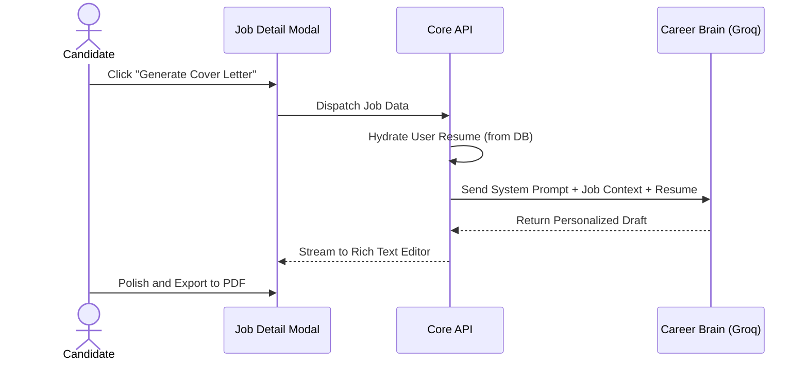

  
  <h1>Core Workflows</h1>
  
<em>The user journey mapping chaos to structure via AI and Kanban methodology.</em>

---

## 📑 Table of Contents

1. [Executive Summary](#-executive-summary)
2. [The Discovery Pipeline (Chrome Extension)](#-the-discovery-pipeline)
3. [The Kanban Progression](#-the-kanban-progression)
4. [AI Automation Flow](#-ai-automation-flow)
5. [The Smart Reminder System](#-the-smart-reminder-system)
6. [Related Documentation](#-related-documentation)

---

## 🎯 Executive Summary

JobPilot doesn't just store data; it actively orchestrates the job search lifecycle. The workflow is designed around minimal manual entry, relying on the Chrome Extension for data ingestion, an interactive Kanban board for progression tracking, and an AI co-pilot for generating tedious documents like cover letters and interview prep sheets.

> [!NOTE]
> **The Golden Rule:** The richer the base data in the `Career Brain` (a user's uploaded resume and preferences), the more accurate and personalized the downstream AI workflows become.

---

## 🔍 The Discovery Pipeline (Chrome Extension)

Users discover jobs on fragmented portals (LinkedIn, Indeed, Wellfound, YC Work at a Startup).

1. **Activation:** The user spots an ideal role and presses `Alt + Shift + J` (or clicks the extension icon).
2. **Scraping Fallbacks:** 
   - *Tier 1:* The content script looks for strict `JSON-LD` schemas (JobPosting).
   - *Tier 2:* It scans for `Microdata` itemprop attributes.
   - *Tier 3:* It falls back to custom CSS selectors targeting specific site DOMs.
3. **Transmission:** The normalized payload is beamed to the `POST /api/jobs` endpoint using the user's synchronized JWT.
4. **Result:** The job appears instantly in the `Saved` column of their dashboard.

---

## 📋 The Kanban Progression

The core interactive experience takes place in the Pipeline view, leveraging `@dnd-kit/core` for fluid physics.

| Stage | Context | Automated Actions |
|-------|---------|-------------------|
| **Saved** | Raw leads captured from the extension. | *None.* Pre-application phase. |
| **Applied** | Application officially submitted. | System sets an initial AI-driven `followUpDate`. |
| **OA** | Online Assessment (HackerRank, LeetCode) received. | Prompts user to link assessment URLs. |
| **Interview** | Moving to synchronous rounds. | Prompts user to generate an **AI Interview Prep** guide based on the specific job description. |
| **Offer** | Negotiation phase. | Tracks expected vs. offered salary metrics. |
| **Rejected** | The journey ends for this role. | Immediately cancels all pending cron-job follow-up reminders. |

---

## 🤖 AI Automation Flow

At any stage of the pipeline, users can trigger the **Groq Llama 3** engine to unblock their progress.

**Available AI Automations:**
- **ATS Scoring:** Cross-references the job description against the uploaded resume.
- **Skill Gap Analysis:** Highlights exact missing keywords (e.g., "Requires GraphQL, but resume only lists REST").
- **Summarization:** Distills a 5-page job description into a 3-bullet executive summary.

---

## 🔔 The Smart Reminder System

A background `node-cron` workflow designed to ensure follow-ups are never forgotten.

1. **Trigger Condition:** A job in the "Applied" or "Interview" stage passes its `followUpDate`.
2. **Chron Sweep:** Every 10 minutes, the backend scans for due reminders using atomic database transactions.
3. **Execution:** 
   - An AI-tailored follow-up email is drafted.
   - Nodemailer transmits the message via the cached SMTP relay.
4. **Resolution:** The job's internal state updates to `Contacted`. If unanswered after 5 days, exponential backoff reschedules a secondary nudge.

---

## 📚 Related Documentation

| Area | Resource |
|------|----------|
| **AI Integration** | [Architecture Details](./architecture.md) |
| **Performance Hooks** | [Performance Engineering](./performance.md) |

 

  <strong>Next Reading:</strong> <a href="./future-plans.md">Future Plans →</a>

